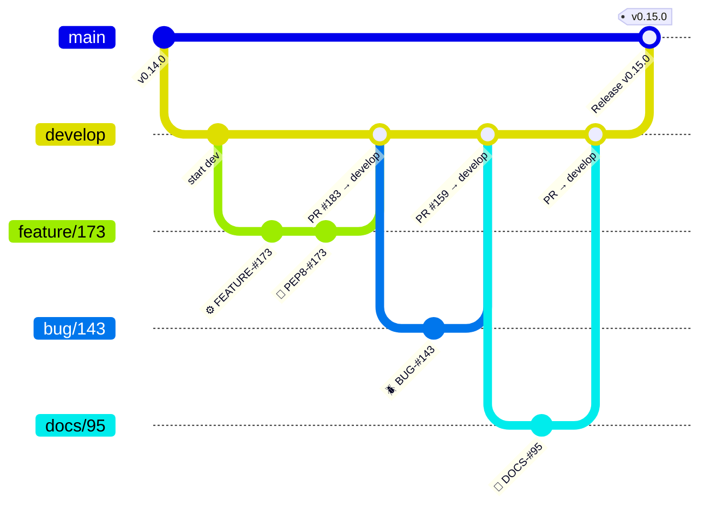

# Contributing to Dotflow

## Getting Help

We use GitHub issues for tracking bugs and feature requests and have limited bandwidth to address them. If you need anything, I ask you to please follow our templates for opening issues or discussions.

- 🐛 [Bug Report](https://github.com/dotflow-io/dotflow/issues/new/choose)
- 📕 [Documentation](https://github.com/dotflow-io/dotflow/issues/new/choose)
- 🚀 [Feature Request](https://github.com/dotflow-io/dotflow/issues/new/choose)
- 💬 [General Question](https://github.com/dotflow-io/dotflow/issues/new/choose)

## Git Workflow

This project follows a **Git Flow** branching model. All development happens on the `develop` branch — never commit directly to `master`.



### Branch Naming

All branches must be created **from `develop`** and follow the pattern:

| Type | Pattern | Example | When to use |
|------|---------|---------|-------------|
| Feature | `feature/<ISSUE-NUMBER>` | `feature/173` | New functionality |
| Bug Fix | `bug/<ISSUE-NUMBER>` | `bug/143` | Fixing a reported bug |
| Documentation | `docs/<ISSUE-NUMBER>` | `docs/95` | Documentation-only changes |
| Release | `release/<VERSION>` | `release/1.0.0` | Preparing a new release |

### Creating a Branch

```bash
git checkout develop
git pull origin develop
git checkout -b feature/123
```

## Commit Style

Every commit must follow the format:

```
<emoji> <TYPE>-#<ISSUE-NUMBER>: <Description>
```

| Icon | Type      | Description                                |
|------|-----------|--------------------------------------------|
| ⚙️   | FEATURE   | New feature                                |
| 📝   | PEP8      | Formatting fixes following PEP8            |
| 📌   | ISSUE     | Reference to issue                         |
| 🪲   | BUG       | Bug fix                                    |
| 📘   | DOCS      | Documentation changes                      |
| 📦   | PyPI      | PyPI releases                              |
| ❤️️   | TEST      | Automated tests                            |
| ⬆️   | CI/CD     | Changes in continuous integration/delivery |
| ⚠️   | SECURITY  | Security improvements                      |

### Examples

```
⚙️ FEATURE-#173: Add GitHub Actions deployer with PyGithub SDK
🪲 BUG-#143: Fix retry=0 causing zero execution attempts
📘 DOCS-#173: Add documentation section and references to README
📝 PEP8-#173: Apply ruff format to CLI commands
❤️ TEST-#173: Add tests for all Lambda variant deployers
📌 ISSUE-#173: Resolve merge conflict with develop
📦 PyPI: Update version to 0.15.0.dev2
```

## Pull Requests

### Target Branch

- Feature/bug/docs branches → open PR against **`develop`**
- Release branches → open PR against **`master`**

### PR Guidelines

When opening a PR, fill out the provided template:

1. **Description** — Summarize the changes and link the related issue
2. **Type of change** — Check the appropriate box (bug fix, feature, breaking change, docs)
3. **Checklist** — Confirm code quality, tests, and documentation

### Before Opening a PR

- [ ] Code follows the project style guidelines
- [ ] Self-review completed
- [ ] Tests added/updated and passing locally
- [ ] No new warnings introduced
- [ ] Documentation updated (if applicable)

## Code Quality

### Linting & Formatting

This project uses **ruff** for formatting and **flake8** + **pylint** for linting.

```bash
# Format code
ruff format .

# Check linting
flake8
pylint dotflow/
```

### Tests

Run the test suite with:

```bash
pytest
```

## Project Structure

```
dotflow/
├── dotflow/          # Main library
│   ├── abc/          # Abstract base classes
│   ├── cli/          # CLI commands
│   ├── cloud/        # Cloud deployers
│   ├── core/         # Core pipeline engine
│   ├── providers/    # Storage/queue providers
│   └── utils/        # Utility functions
├── tests/            # Test suite
├── docs/             # MkDocs documentation source
├── docs_src/         # Documentation examples
├── examples/         # Usage examples
└── scripts/          # Build/utility scripts
```

## Development Setup

```bash
# Clone the repository
git clone https://github.com/dotflow-io/dotflow.git
cd dotflow

# Install dependencies with Poetry
poetry install --all-extras

# Activate the virtual environment
poetry shell
```

## Summary

1. **Branch from `develop`** using the naming convention
2. **Commit** with emoji + type + issue number
3. **Open a PR** against `develop` (or `master` for releases)
4. **Pass all checks** — linting, tests, and self-review
5. Wait for code review and approval before merging
