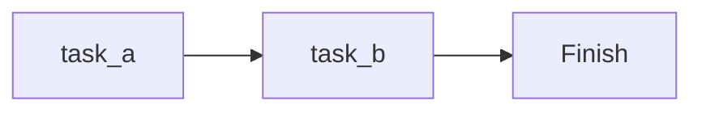
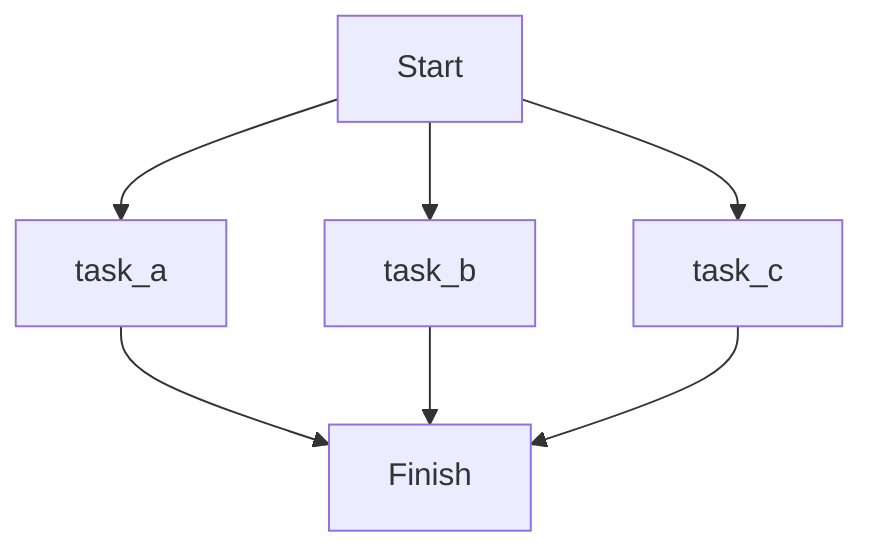
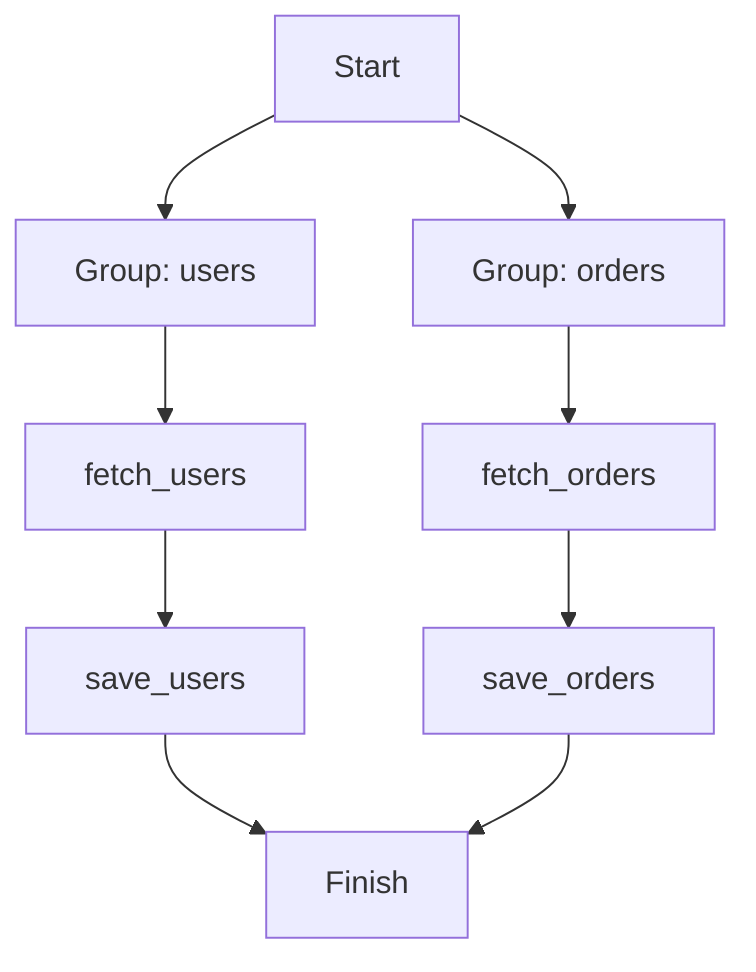

<div align="center">


**import dotflow. @action. deploy. Done.**

[](https://pypi.org/project/dotflow/)
[](https://pypi.org/project/dotflow/)
[](https://pypi.org/project/dotflow/)
[](https://github.com/dotflow-io/dotflow)

[Website](https://www.cloud.dotflow.io) · [Documentation](https://dotflow-io.github.io/dotflow/) · [PyPI](https://pypi.org/project/dotflow/)

</div>

---

# Dotflow

Dotflow is a lightweight Python library for execution pipelines. Define tasks with decorators, chain them together, and deploy to any cloud — with built-in retry, parallel execution, storage, observability, and cloud deployment.

## Why Dotflow?

- **Simple** — `@action` decorator + `workflow.start()`. That's it.
- **Resilient** — Retry, backoff, timeout, checkpoints, and error handling out of the box.
- **Observable** — OpenTelemetry traces, metrics, and logs. Sentry error tracking.
- **Deployable** — `dotflow deploy --platform lambda` ships your pipeline to AWS in one command.
- **Portable** — Same code runs on Lambda, ECS, Cloud Run, Alibaba FC, Kubernetes, Docker, or GitHub Actions.

## Install

```bash
pip install dotflow
```

## Quick Start

```python
from dotflow import DotFlow, action

@action
def extract():
    return {"users": 150}

@action
def transform(previous_context):
    total = previous_context.storage["users"]
    return {"users": total, "active": int(total * 0.8)}

@action
def load(previous_context):
    print(f"Loaded {previous_context.storage['active']} active users")

workflow = DotFlow()
workflow.task.add(step=extract)
workflow.task.add(step=transform)
workflow.task.add(step=load)

workflow.start()
```

## Deploy anywhere

Write your pipeline once. Deploy to any cloud with a single command.

```bash
dotflow init
dotflow deploy --platform lambda --project my_pipeline
```

### Supported platforms

| Platform | Deploy method |
|----------|---------------|
|  **Docker** | `docker compose up` |
|  **AWS Lambda** | `dotflow deploy` |
|   **AWS Lambda + EventBridge** | `dotflow deploy --schedule` |
|   **AWS Lambda + S3 Trigger** | `dotflow deploy` |
|   **AWS Lambda + SQS Trigger** | `dotflow deploy` |
|   **AWS Lambda + API Gateway** | `dotflow deploy` |
|  **AWS ECS Fargate** | `dotflow deploy` |
|   **AWS ECS + EventBridge** | `dotflow deploy --schedule` |
|  **Google Cloud Run** | `dotflow deploy` |
|   **Cloud Run + Scheduler** | `dotflow deploy --schedule` |
|  **Kubernetes** | `kubectl apply` |
|  **Alibaba Cloud FC** | `dotflow deploy` |
|  **Alibaba Cloud FC + Timer** | `dotflow deploy --schedule` |
|  **GitHub Actions** | `dotflow deploy` |

> [See all 34+ platforms →](https://dotflow-io.github.io/dotflow/nav/cloud/)

## Optional extras

```bash
pip install dotflow[aws]            # S3 storage
pip install dotflow[gcp]            # Google Cloud Storage
pip install dotflow[scheduler]      # Cron scheduler
pip install dotflow[otel]           # OpenTelemetry
pip install dotflow[sentry]         # Sentry error tracking
pip install dotflow[deploy-aws]      # AWS deploy (Lambda, ECS)
pip install dotflow[deploy-gcp]      # GCP deploy (Cloud Run)
pip install dotflow[deploy-alibaba]  # Alibaba Cloud deploy (FC)
pip install dotflow[deploy-github]   # GitHub Actions deploy
```

> **[Read the full documentation →](https://dotflow-io.github.io/dotflow/)**

## Documentation

| Section | Description |
|---------|-------------|
| [Concepts](https://dotflow-io.github.io/dotflow/nav/concepts/concept-workflow-and-tasks/) | Workflows, tasks, context, providers, process modes |
| [How-to Guides](https://dotflow-io.github.io/dotflow/nav/how-to/) | Step-by-step tutorials for workflows, tasks, and CLI |
| [Cloud Deployment](https://dotflow-io.github.io/dotflow/nav/cloud/) | Deploy to AWS, GCP, Alibaba, Kubernetes, Docker, GitHub Actions |
| [Integrations](https://dotflow-io.github.io/dotflow/nav/integrations/) | OpenTelemetry, Sentry, Telegram, Discord, S3, GCS, Server |
| [Examples](https://dotflow-io.github.io/dotflow/nav/examples/) | Real-world pipelines: ETL, health checks, async, scheduler |
| [Reference](https://dotflow-io.github.io/dotflow/nav/reference/dotflow/) | API reference for all classes and providers |
| [Custom Providers](https://dotflow-io.github.io/dotflow/nav/development/custom-providers/) | Build your own storage, notify, log, tracer, or metrics provider |

## Features

<details>
<summary><strong>Observability</strong></summary>

> [OpenTelemetry docs](https://dotflow-io.github.io/dotflow/nav/tutorial/log-opentelemetry/) | [Sentry docs](https://dotflow-io.github.io/dotflow/nav/tutorial/log-sentry/) | [Tracer docs](https://dotflow-io.github.io/dotflow/nav/tutorial/tracer-opentelemetry/) | [Metrics docs](https://dotflow-io.github.io/dotflow/nav/tutorial/metrics-opentelemetry/)

Built-in support for OpenTelemetry and Sentry:

```python
from dotflow import Config
from dotflow.providers import LogOpenTelemetry, TracerOpenTelemetry, MetricsOpenTelemetry

# OpenTelemetry: traces, metrics, and structured logs
config = Config(
    log=LogOpenTelemetry(service_name="my-pipeline"),
    tracer=TracerOpenTelemetry(service_name="my-pipeline"),
    metrics=MetricsOpenTelemetry(service_name="my-pipeline"),
)
```

```python
from dotflow.providers import LogSentry, TracerSentry

# Sentry: error tracking + performance monitoring
config = Config(
    log=LogSentry(dsn="https://xxx@sentry.io/123"),
    tracer=TracerSentry(),
)
```

</details>

<details>
<summary><strong>Execution Modes</strong></summary>

> [Process Mode docs](https://dotflow-io.github.io/dotflow/nav/concepts/process-mode-sequential/)

Dotflow supports 4 execution strategies out of the box:

#### Sequential (default)

Tasks run one after another. The context from each task flows to the next.

```python
workflow.task.add(step=task_a)
workflow.task.add(step=task_b)

workflow.start()  # or mode="sequential"
```



#### Background

Same as sequential, but runs in a background thread — non-blocking.

```python
workflow.start(mode="background")
```

#### Parallel

Every task runs simultaneously in its own process.

```python
workflow.task.add(step=task_a)
workflow.task.add(step=task_b)
workflow.task.add(step=task_c)

workflow.start(mode="parallel")
```



#### Parallel Groups

Assign tasks to named groups. Groups run in parallel, but tasks within each group run sequentially.

```python
workflow.task.add(step=fetch_users, group_name="users")
workflow.task.add(step=save_users, group_name="users")
workflow.task.add(step=fetch_orders, group_name="orders")
workflow.task.add(step=save_orders, group_name="orders")

workflow.start()
```



---

</details>

<details>
<summary><strong>Retry, Timeout & Backoff</strong></summary>

> [Retry docs](https://dotflow-io.github.io/dotflow/nav/tutorial/task-retry/) | [Backoff docs](https://dotflow-io.github.io/dotflow/nav/tutorial/task-backoff/) | [Timeout docs](https://dotflow-io.github.io/dotflow/nav/tutorial/task-timeout/)

The `@action` decorator supports built-in resilience options:

```python
@action(retry=3, timeout=10, retry_delay=2, backoff=True)
def unreliable_api_call():
    response = requests.get("https://api.example.com/data")
    response.raise_for_status()
    return response.json()
```

| Parameter | Type | Default | Description |
|-----------|------|---------|-------------|
| `retry` | `int` | `1` | Number of attempts before failing |
| `timeout` | `int` | `0` | Max seconds per attempt (0 = no limit) |
| `retry_delay` | `int` | `1` | Seconds to wait between retries |
| `backoff` | `bool` | `False` | Exponential backoff (delay doubles each retry) |

---

</details>

<details>
<summary><strong>Context System</strong></summary>

> [Context docs](https://dotflow-io.github.io/dotflow/nav/tutorial/initial-context/) | [Previous Context](https://dotflow-io.github.io/dotflow/nav/tutorial/previous-context/) | [Many Contexts](https://dotflow-io.github.io/dotflow/nav/tutorial/many-contexts/)

Tasks communicate through a context chain. Each task receives the previous task's output and can access its own initial context.

```python
@action
def step_one():
    return "Hello"

@action
def step_two(previous_context, initial_context):
    greeting = previous_context.storage   # "Hello"
    name = initial_context.storage        # "World"
    return f"{greeting}, {name}!"

workflow = DotFlow()
workflow.task.add(step=step_one)
workflow.task.add(step=step_two, initial_context="World")
workflow.start()
```

Each `Context` object contains:
- **`storage`** — the return value from the task
- **`task_id`** — the task identifier
- **`workflow_id`** — the workflow identifier
- **`time`** — timestamp of execution

---

</details>

<details>
<summary><strong>Checkpoint & Resume</strong></summary>

> [Checkpoint docs](https://dotflow-io.github.io/dotflow/nav/tutorial/checkpoint/)

Resume a workflow from where it left off. Requires a persistent storage provider and a fixed `workflow_id`.

```python
from dotflow import DotFlow, Config, action
from dotflow.providers import StorageFile

config = Config(storage=StorageFile())

workflow = DotFlow(config=config, workflow_id="my-pipeline-v1")
workflow.task.add(step=step_a)
workflow.task.add(step=step_b)
workflow.task.add(step=step_c)

# First run — executes all tasks and saves checkpoints
workflow.start()

# If step_c failed, fix and re-run — skips step_a and step_b
workflow.start(resume=True)
```

---

</details>

<details>
<summary><strong>Storage Providers</strong></summary>

> [Storage docs](https://dotflow-io.github.io/dotflow/nav/tutorial/storage-default/)

Choose where task results are persisted:

#### In-Memory (default)

```python
from dotflow import DotFlow

workflow = DotFlow()  # uses StorageDefault (in-memory)
```

#### File System

```python
from dotflow import DotFlow, Config
from dotflow.providers import StorageFile

config = Config(storage=StorageFile(path=".output"))
workflow = DotFlow(config=config)
```

#### AWS S3

```bash
pip install dotflow[aws]
```

```python
from dotflow import DotFlow, Config
from dotflow.providers import StorageS3

config = Config(storage=StorageS3(bucket="my-bucket", prefix="pipelines/", region="us-east-1"))
workflow = DotFlow(config=config)
```

#### Google Cloud Storage

```bash
pip install dotflow[gcp]
```

```python
from dotflow import DotFlow, Config
from dotflow.providers import StorageGCS

config = Config(storage=StorageGCS(bucket="my-bucket", prefix="pipelines/", project="my-project"))
workflow = DotFlow(config=config)
```

---

</details>

<details>
<summary><strong>Notifications</strong></summary>

> [Telegram docs](https://dotflow-io.github.io/dotflow/nav/tutorial/notify-telegram/) | [Discord docs](https://dotflow-io.github.io/dotflow/nav/tutorial/notify-discord/)

Get notified about task status changes via Telegram or Discord.

```python
from dotflow import Config
from dotflow.providers import NotifyTelegram

config = Config(notify=NotifyTelegram(
    token="YOUR_BOT_TOKEN",
    chat_id=123456789,
))
```

```python
from dotflow.providers import NotifyDiscord

config = Config(notify=NotifyDiscord(
    webhook_url="https://discord.com/api/webhooks/...",
))
```

---

</details>

<details>
<summary><strong>Class-Based Steps</strong></summary>

Return a class instance from a task, and Dotflow will automatically discover and execute all `@action`-decorated methods in source order.

```python
from dotflow import action

class ETLPipeline:
    @action
    def extract(self):
        return {"raw": [1, 2, 3]}

    @action
    def transform(self, previous_context):
        data = previous_context.storage["raw"]
        return {"processed": [x * 2 for x in data]}

    @action
    def load(self, previous_context):
        print(f"Loaded: {previous_context.storage['processed']}")

@action
def run_pipeline():
    return ETLPipeline()

workflow = DotFlow()
workflow.task.add(step=run_pipeline)
workflow.start()
```

---

</details>

<details>
<summary><strong>Task Groups</strong></summary>

> [Groups docs](https://dotflow-io.github.io/dotflow/nav/tutorial/groups/)

Organize tasks into named groups for parallel group execution.

```python
workflow.task.add(step=scrape_site_a, group_name="scraping")
workflow.task.add(step=scrape_site_b, group_name="scraping")
workflow.task.add(step=process_data, group_name="processing")
workflow.task.add(step=save_results, group_name="processing")

workflow.start()  # groups run in parallel, tasks within each group run sequentially
```

---

</details>

<details>
<summary><strong>Callbacks</strong></summary>

> [Task Callback docs](https://dotflow-io.github.io/dotflow/nav/tutorial/task-callback/) | [Workflow Callback docs](https://dotflow-io.github.io/dotflow/nav/tutorial/workflow-callback/)

Execute a function after each task completes — useful for logging, alerting, or side effects.

```python
def on_task_done(task):
    print(f"Task {task.task_id} finished with status: {task.status}")

workflow.task.add(step=my_step, callback=on_task_done)
```

Workflow-level callbacks for success and failure:

```python
def on_success(*args, **kwargs):
    print("All tasks completed!")

def on_failure(*args, **kwargs):
    print("Something went wrong.")

workflow.start(on_success=on_success, on_failure=on_failure)
```

---

</details>

<details>
<summary><strong>Error Handling</strong></summary>

> [Error Handling docs](https://dotflow-io.github.io/dotflow/nav/tutorial/error-handling/) | [Keep Going docs](https://dotflow-io.github.io/dotflow/nav/tutorial/keep-going/)

Control whether the workflow stops or continues when a task fails:

```python
# Stop on first failure (default)
workflow.start(keep_going=False)

# Continue executing remaining tasks even if one fails
workflow.start(keep_going=True)
```

Each task tracks its errors with full detail:
- Attempt number
- Exception type and message
- Traceback

Access results after execution:

```python
for task in workflow.result_task():
    print(f"Task {task.task_id}: {task.status}")
    if task.errors:
        print(f"  Errors: {task.errors}")
```

---

</details>

<details>
<summary><strong>Async Support</strong></summary>

> [Async docs](https://dotflow-io.github.io/dotflow/nav/tutorial/async-actions/)

`@action` automatically detects and handles async functions:

```python
import httpx
from dotflow import DotFlow, action

@action(timeout=30)
async def fetch_data():
    async with httpx.AsyncClient() as client:
        response = await client.get("https://api.example.com/data")
        return response.json()

workflow = DotFlow()
workflow.task.add(step=fetch_data)
workflow.start()
```

---

</details>

<details>
<summary><strong>Scheduler / Cron</strong></summary>

> [Cron scheduler docs](https://dotflow-io.github.io/dotflow/nav/tutorial/scheduler-cron/) | [Default scheduler](https://dotflow-io.github.io/dotflow/nav/tutorial/scheduler-default/) | [Cron overlap (concepts)](https://dotflow-io.github.io/dotflow/nav/concepts/concept-cron-overlap/)

Schedule workflows to run automatically using cron expressions.

```bash
pip install dotflow[scheduler]
```

```python
from dotflow import DotFlow, Config, action
from dotflow.providers import SchedulerCron

@action
def sync_data():
    return {"synced": True}

config = Config(scheduler=SchedulerCron(cron="*/5 * * * *"))

workflow = DotFlow(config=config)
workflow.task.add(step=sync_data)
workflow.schedule()
```

#### Overlap Strategies

Control what happens when a new execution triggers while the previous one is still running:

| Strategy | Description |
|----------|-------------|
| `skip` | Drops the new run if the previous is still active (default) |
| `queue` | Buffers one pending run, executes when the current finishes |
| `parallel` | Runs up to 10 concurrent executions via semaphore |

```python
from dotflow.providers import SchedulerCron

# Queue overlapping executions
scheduler = SchedulerCron(cron="*/5 * * * *", overlap="queue")

# Allow parallel executions
scheduler = SchedulerCron(cron="*/5 * * * *", overlap="parallel")
```

The scheduler handles graceful shutdown via `SIGINT`/`SIGTERM` signals automatically.

---

</details>

<details>
<summary><strong>CLI</strong></summary>

> [CLI docs](https://dotflow-io.github.io/dotflow/nav/how-to/cli/simple-start/)

Run workflows directly from the command line:

```bash
# Simple execution
dotflow start --step my_module.my_task

# With initial context
dotflow start --step my_module.my_task --initial-context '{"key": "value"}'

# With callback
dotflow start --step my_module.my_task --callback my_module.on_done

# With execution mode
dotflow start --step my_module.my_task --mode parallel

# With file storage
dotflow start --step my_module.my_task --storage file --path .output

# With S3 storage
dotflow start --step my_module.my_task --storage s3

# With GCS storage
dotflow start --step my_module.my_task --storage gcs

# Schedule with cron
dotflow schedule --step my_module.my_task --cron "*/5 * * * *"

# Schedule with overlap strategy
dotflow schedule --step my_module.my_task --cron "0 * * * *" --overlap queue

# Schedule with resume
dotflow schedule --step my_module.my_task --cron "0 */6 * * *" --storage file --resume
```

Available CLI commands:

| Command | Description |
|---------|-------------|
| `dotflow init` | Scaffold a new project with cloud support |
| `dotflow start` | Run a workflow |
| `dotflow schedule` | Run a workflow on a cron schedule |
| `dotflow logs` | View execution logs |
| `dotflow cloud list` | Show available cloud platforms |
| `dotflow cloud generate --platform <name>` | Generate deployment files |
| `dotflow deploy --platform <name> --project <name>` | Deploy to cloud |

---

</details>

<details>
<summary><strong>Server Provider</strong></summary>

> [Server docs](https://dotflow-io.github.io/dotflow/nav/tutorial/server-default/)

Send workflow and task execution data to a remote API (e.g. dotflow-api) in real time.

```python
from dotflow import DotFlow, Config, action
from dotflow.providers import ServerDefault

@action
def my_task():
    return {"result": "ok"}

config = Config(
    server=ServerDefault(
        base_url="http://localhost:8000/api/v1",
        user_token="your-api-token",
    )
)

workflow = DotFlow(config=config)
workflow.task.add(step=my_task)
workflow.start()
```

| Parameter | Type | Default | Description |
|-----------|------|---------|-------------|
| `base_url` | `str` | `""` | API base URL |
| `user_token` | `str` | `""` | API token (`X-User-Token` header) |
| `timeout` | `float` | `5.0` | HTTP request timeout in seconds |

The server provider automatically:
- Creates the workflow on `DotFlow()` init
- Creates each task on `task.add()`
- Updates task status on each transition (In progress, Completed, Failed, Retry)
- Updates workflow status on completion (In progress → Completed)

---

</details>

<details>
<summary><strong>Dependency Injection via Config</strong></summary>

The `Config` class lets you swap providers for storage, notifications, logging, scheduling, and server:

```python
from dotflow import DotFlow, Config
from dotflow.providers import StorageFile, NotifyTelegram, LogDefault, SchedulerCron, ServerDefault

config = Config(
    storage=StorageFile(path=".output"),
    notify=NotifyTelegram(token="...", chat_id=123),
    log=LogDefault(),
    scheduler=SchedulerCron(cron="0 * * * *"),
    server=ServerDefault(base_url="...", user_token="..."),
)

workflow = DotFlow(config=config)
```

Extend Dotflow by implementing the abstract base classes:

| ABC | Methods | Purpose |
|-----|---------|---------|
| `Storage` | `post`, `get`, `key` | Custom storage backends |
| `Notify` | `hook_status_task` | Custom notification channels |
| `Log` | `info`, `error`, `warning`, `debug` | Custom logging |
| `Scheduler` | `start`, `stop` | Custom scheduling strategies |
| `Tracer` | `start_workflow`, `end_workflow`, `start_task`, `end_task` | Distributed tracing |
| `Metrics` | `workflow_started`, `workflow_completed`, `workflow_failed`, `task_completed`, `task_failed`, `task_retried` | Counters and histograms |
| `Server` | `create_workflow`, `update_workflow`, `create_task`, `update_task` | Remote API communication |

---

</details>

<details>
<summary><strong>Results & Inspection</strong></summary>

After execution, inspect results directly from the workflow object:

```python
workflow.start()

# List of Task objects
tasks = workflow.result_task()

# List of Context objects (one per task)
contexts = workflow.result_context()

# List of storage values (raw return values)
storages = workflow.result_storage()

# Serialized result (Pydantic model)
result = workflow.result()
```

Task builder utilities:

```python
workflow.task.count()     # Number of tasks
workflow.task.clear()     # Remove all tasks
workflow.task.reverse()   # Reverse execution order
workflow.task.schema()    # Pydantic schema of the workflow
```

---

</details>

<details>
<summary><strong>Dynamic Module Import</strong></summary>

Reference tasks and callbacks by their module path string instead of importing them directly:

```python
workflow.task.add(step="my_package.tasks.process_data")
workflow.task.add(step="my_package.tasks.save_results", callback="my_package.callbacks.notify")
```

---

</details>


## More Examples

All examples are available in the [`docs_src/`](https://github.com/dotflow-io/dotflow/tree/develop/docs_src) directory.

## Commit Style

| Icon | Type      | Description                                |
|------|-----------|--------------------------------------------|
| ⚙️   | FEATURE   | New feature                                |
| 📝   | PEP8      | Formatting fixes following PEP8            |
| 📌   | ISSUE     | Reference to issue                         |
| 🪲   | BUG       | Bug fix                                    |
| 📘   | DOCS      | Documentation changes                      |
| 📦   | PyPI      | PyPI releases                              |
| ❤️️   | TEST      | Automated tests                            |
| ⬆️   | CI/CD     | Changes in continuous integration/delivery |
| ⚠️   | SECURITY  | Security improvements                      |

## License


This project is licensed under the terms of the Apache License 2.0.
