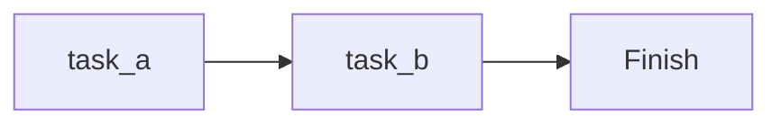
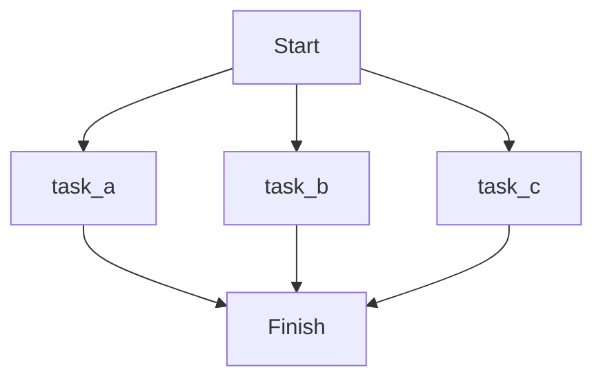
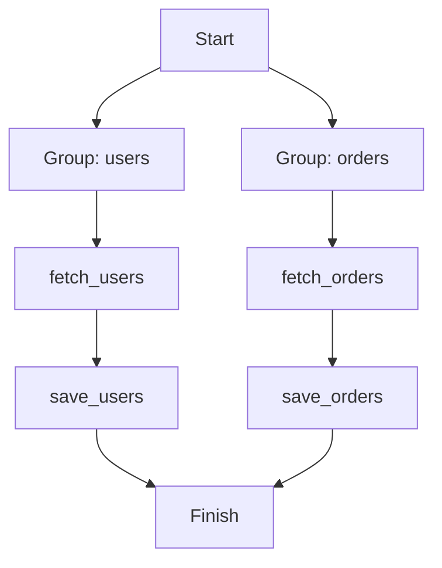

<div align="center">
  <a aria-label="Serverless.com" href="https://dotflow.io">Website</a>
  &nbsp;•&nbsp;
  <a aria-label="Dotflow Documentation" href="https://dotflow-io.github.io/dotflow/">Documentation</a>
  &nbsp;•&nbsp;
  <a aria-label="Pypi" href="https://pypi.org/project/dotflow/">Pypi</a>
</div>

<br/>

<div align="center">


</div>

# Welcome to Dotflow

Dotflow is a lightweight Python library for building execution pipelines. Define tasks with decorators, chain them together, and run workflows in sequential, parallel, or background mode — with built-in retry, timeout, storage, notifications, and more.

## Table of Contents

<details>
<summary>Click to expand</summary>

- [Getting Help](#getting-help)
- [Installation](#installation)
- [Quick Start](#quick-start)
- [Features](#features)
  - [Execution Modes](#execution-modes)
  - [Retry, Timeout & Backoff](#retry-timeout--backoff)
  - [Context System](#context-system)
  - [Checkpoint & Resume](#checkpoint--resume)
  - [Storage Providers](#storage-providers)
  - [Notifications](#notifications)
  - [Class-Based Steps](#class-based-steps)
  - [Task Groups](#task-groups)
  - [Callbacks](#callbacks)
  - [Error Handling](#error-handling)
  - [Async Support](#async-support)
  - [CLI](#cli)
  - [Dependency Injection via Config](#dependency-injection-via-config)
- [More Examples](#more-examples)
- [Commit Style](#commit-style)
- [License](#license)

</details>

## Getting Help

We use GitHub issues for tracking bugs and feature requests.

- [Bug Report](https://github.com/dotflow-io/dotflow/issues/new/choose)
- [Documentation](https://github.com/dotflow-io/dotflow/issues/new/choose)
- [Feature Request](https://github.com/dotflow-io/dotflow/issues/new/choose)
- [Security Issue](https://github.com/dotflow-io/dotflow/issues/new/choose)
- [General Question](https://github.com/dotflow-io/dotflow/issues/new/choose)

## Installation

```bash
pip install dotflow
```

**Optional extras:**

```bash
pip install dotflow[aws]      # AWS S3 storage
pip install dotflow[gcp]      # Google Cloud Storage
```

## Quick Start

```python
from dotflow import DotFlow, action

@action
def extract():
    return {"users": 150}

@action
def transform(previous_context):
    total = previous_context.storage["users"]
    return {"users": total, "active": int(total * 0.8)}

@action
def load(previous_context):
    print(f"Loaded {previous_context.storage['active']} active users")

workflow = DotFlow()
workflow.task.add(step=extract)
workflow.task.add(step=transform)
workflow.task.add(step=load)

workflow.start()
```

## Features

### Execution Modes

Dotflow supports 4 execution strategies out of the box:

#### Sequential (default)

Tasks run one after another. The context from each task flows to the next.

```python
workflow.task.add(step=task_a)
workflow.task.add(step=task_b)

workflow.start()  # or mode="sequential"
```



#### Background

Same as sequential, but runs in a background thread — non-blocking.

```python
workflow.start(mode="background")
```

#### Parallel

Every task runs simultaneously in its own process.

```python
workflow.task.add(step=task_a)
workflow.task.add(step=task_b)
workflow.task.add(step=task_c)

workflow.start(mode="parallel")
```



#### Parallel Groups

Assign tasks to named groups. Groups run in parallel, but tasks within each group run sequentially.

```python
workflow.task.add(step=fetch_users, group_name="users")
workflow.task.add(step=save_users, group_name="users")
workflow.task.add(step=fetch_orders, group_name="orders")
workflow.task.add(step=save_orders, group_name="orders")

workflow.start()
```



---

### Retry, Timeout & Backoff

The `@action` decorator supports built-in resilience options:

```python
@action(retry=3, timeout=10, retry_delay=2, backoff=True)
def unreliable_api_call():
    response = requests.get("https://api.example.com/data")
    response.raise_for_status()
    return response.json()
```

| Parameter | Type | Default | Description |
|-----------|------|---------|-------------|
| `retry` | `int` | `1` | Number of attempts before failing |
| `timeout` | `int` | `0` | Max seconds per attempt (0 = no limit) |
| `retry_delay` | `int` | `1` | Seconds to wait between retries |
| `backoff` | `bool` | `False` | Exponential backoff (delay doubles each retry) |

---

### Context System

Tasks communicate through a context chain. Each task receives the previous task's output and can access its own initial context.

```python
@action
def step_one():
    return "Hello"

@action
def step_two(previous_context, initial_context):
    greeting = previous_context.storage   # "Hello"
    name = initial_context.storage        # "World"
    return f"{greeting}, {name}!"

workflow = DotFlow()
workflow.task.add(step=step_one)
workflow.task.add(step=step_two, initial_context="World")
workflow.start()
```

Each `Context` object contains:
- **`storage`** — the return value from the task
- **`task_id`** — the task identifier
- **`workflow_id`** — the workflow identifier
- **`time`** — timestamp of execution

---

### Checkpoint & Resume

Resume a workflow from where it left off. Requires a persistent storage provider and a fixed `workflow_id`.

```python
from dotflow import DotFlow, Config, action
from dotflow.providers import StorageFile

config = Config(storage=StorageFile())

workflow = DotFlow(config=config, workflow_id="my-pipeline-v1")
workflow.task.add(step=step_a)
workflow.task.add(step=step_b)
workflow.task.add(step=step_c)

# First run — executes all tasks and saves checkpoints
workflow.start()

# If step_c failed, fix and re-run — skips step_a and step_b
workflow.start(resume=True)
```

---

### Storage Providers

Choose where task results are persisted:

#### In-Memory (default)

```python
from dotflow import DotFlow

workflow = DotFlow()  # uses StorageDefault (in-memory)
```

#### File System

```python
from dotflow import DotFlow, Config
from dotflow.providers import StorageFile

config = Config(storage=StorageFile(path=".output"))
workflow = DotFlow(config=config)
```

#### AWS S3

```bash
pip install dotflow[aws]
```

```python
from dotflow import DotFlow, Config
from dotflow.providers import StorageS3

config = Config(storage=StorageS3(bucket="my-bucket", prefix="pipelines/", region="us-east-1"))
workflow = DotFlow(config=config)
```

#### Google Cloud Storage

```bash
pip install dotflow[gcp]
```

```python
from dotflow import DotFlow, Config
from dotflow.providers import StorageGCS

config = Config(storage=StorageGCS(bucket="my-bucket", prefix="pipelines/", project="my-project"))
workflow = DotFlow(config=config)
```

---

### Notifications

Get notified about task status changes via Telegram.

```python
from dotflow import DotFlow, Config
from dotflow.providers import NotifyTelegram
from dotflow.core.types.status import TypeStatus

notify = NotifyTelegram(
    token="YOUR_BOT_TOKEN",
    chat_id=123456789,
    notification_type=TypeStatus.FAILED,  # only notify on failures (optional)
)

config = Config(notify=notify)
workflow = DotFlow(config=config)
```

Status types: `NOT_STARTED`, `IN_PROGRESS`, `COMPLETED`, `PAUSED`, `RETRY`, `FAILED`

---

### Class-Based Steps

Return a class instance from a task, and Dotflow will automatically discover and execute all `@action`-decorated methods in source order.

```python
from dotflow import action

class ETLPipeline:
    @action
    def extract(self):
        return {"raw": [1, 2, 3]}

    @action
    def transform(self, previous_context):
        data = previous_context.storage["raw"]
        return {"processed": [x * 2 for x in data]}

    @action
    def load(self, previous_context):
        print(f"Loaded: {previous_context.storage['processed']}")

@action
def run_pipeline():
    return ETLPipeline()

workflow = DotFlow()
workflow.task.add(step=run_pipeline)
workflow.start()
```

---

### Task Groups

Organize tasks into named groups for parallel group execution.

```python
workflow.task.add(step=scrape_site_a, group_name="scraping")
workflow.task.add(step=scrape_site_b, group_name="scraping")
workflow.task.add(step=process_data, group_name="processing")
workflow.task.add(step=save_results, group_name="processing")

workflow.start()  # groups run in parallel, tasks within each group run sequentially
```

---

### Callbacks

Execute a function after each task completes — useful for logging, alerting, or side effects.

```python
def on_task_done(task):
    print(f"Task {task.task_id} finished with status: {task.status}")

workflow.task.add(step=my_step, callback=on_task_done)
```

Workflow-level callbacks for success and failure:

```python
def on_success(*args, **kwargs):
    print("All tasks completed!")

def on_failure(*args, **kwargs):
    print("Something went wrong.")

workflow.start(on_success=on_success, on_failure=on_failure)
```

---

### Error Handling

Control whether the workflow stops or continues when a task fails:

```python
# Stop on first failure (default)
workflow.start(keep_going=False)

# Continue executing remaining tasks even if one fails
workflow.start(keep_going=True)
```

Each task tracks its errors with full detail:
- Attempt number
- Exception type and message
- Traceback

Access results after execution:

```python
for task in workflow.result_task():
    print(f"Task {task.task_id}: {task.status}")
    if task.errors:
        print(f"  Errors: {task.errors}")
```

---

### Async Support

`@action` automatically detects and handles async functions:

```python
import httpx
from dotflow import DotFlow, action

@action(timeout=30)
async def fetch_data():
    async with httpx.AsyncClient() as client:
        response = await client.get("https://api.example.com/data")
        return response.json()

workflow = DotFlow()
workflow.task.add(step=fetch_data)
workflow.start()
```

---

### CLI

Run workflows directly from the command line:

```bash
# Simple execution
dotflow start --step my_module.my_task

# With initial context
dotflow start --step my_module.my_task --initial-context '{"key": "value"}'

# With callback
dotflow start --step my_module.my_task --callback my_module.on_done

# With execution mode
dotflow start --step my_module.my_task --mode parallel

# With file storage
dotflow start --step my_module.my_task --storage file --path .output
```

Available CLI commands:

| Command | Description |
|---------|-------------|
| `dotflow init` | Initialize a new Dotflow project |
| `dotflow start` | Run a workflow |
| `dotflow log` | View execution logs |

---

### Dependency Injection via Config

The `Config` class lets you swap providers for storage, notifications, logging, and API integration:

```python
from dotflow import DotFlow, Config
from dotflow.providers import StorageFile, NotifyTelegram, LogDefault

config = Config(
    storage=StorageFile(path=".output"),
    notify=NotifyTelegram(token="...", chat_id=123),
    log=LogDefault(),
)

workflow = DotFlow(config=config)
```

Extend Dotflow by implementing the abstract base classes:

| ABC | Methods | Purpose |
|-----|---------|---------|
| `Storage` | `post`, `get`, `key` | Custom storage backends |
| `Notify` | `send` | Custom notification channels |
| `Log` | `info`, `error` | Custom logging |

---

### Results & Inspection

After execution, inspect results directly from the workflow object:

```python
workflow.start()

# List of Task objects
tasks = workflow.result_task()

# List of Context objects (one per task)
contexts = workflow.result_context()

# List of storage values (raw return values)
storages = workflow.result_storage()

# Serialized result (Pydantic model)
result = workflow.result()
```

Task builder utilities:

```python
workflow.task.count()     # Number of tasks
workflow.task.clear()     # Remove all tasks
workflow.task.reverse()   # Reverse execution order
workflow.task.schema()    # Pydantic schema of the workflow
```

---

### Dynamic Module Import

Reference tasks and callbacks by their module path string instead of importing them directly:

```python
workflow.task.add(step="my_package.tasks.process_data")
workflow.task.add(step="my_package.tasks.save_results", callback="my_package.callbacks.notify")
```

---

## More Examples

All examples are available in the [`docs_src/`](https://github.com/dotflow-io/dotflow/tree/develop/docs_src) directory.

#### Basic

| Example | Description | Command |
|---------|-------------|---------|
| [first_steps](https://github.com/dotflow-io/dotflow/blob/develop/docs_src/first_steps/first_steps.py) | Minimal workflow with callback | `python docs_src/first_steps/first_steps.py` |
| [simple_function_workflow](https://github.com/dotflow-io/dotflow/blob/develop/docs_src/basic/simple_function_workflow.py) | Simple function-based workflow | `python docs_src/basic/simple_function_workflow.py` |
| [simple_class_workflow](https://github.com/dotflow-io/dotflow/blob/develop/docs_src/basic/simple_class_workflow.py) | Class-based step with retry | `python docs_src/basic/simple_class_workflow.py` |
| [simple_function_workflow_with_error](https://github.com/dotflow-io/dotflow/blob/develop/docs_src/basic/simple_function_workflow_with_error.py) | Error inspection after failure | `python docs_src/basic/simple_function_workflow_with_error.py` |

#### Async

| Example | Description | Command |
|---------|-------------|---------|
| [async_action](https://github.com/dotflow-io/dotflow/blob/develop/docs_src/async/async_action.py) | Async task functions | `python docs_src/async/async_action.py` |

#### Context

| Example | Description | Command |
|---------|-------------|---------|
| [context](https://github.com/dotflow-io/dotflow/blob/develop/docs_src/context/context.py) | Creating and inspecting a Context | `python docs_src/context/context.py` |
| [initial_context](https://github.com/dotflow-io/dotflow/blob/develop/docs_src/initial_context/initial_context.py) | Passing initial context per task | `python docs_src/initial_context/initial_context.py` |
| [previous_context](https://github.com/dotflow-io/dotflow/blob/develop/docs_src/previous_context/previous_context.py) | Chaining context between tasks | `python docs_src/previous_context/previous_context.py` |
| [many_contexts](https://github.com/dotflow-io/dotflow/blob/develop/docs_src/context/many_contexts.py) | Using both initial and previous context | `python docs_src/context/many_contexts.py` |

#### Process Modes

| Example | Description | Command |
|---------|-------------|---------|
| [sequential](https://github.com/dotflow-io/dotflow/blob/develop/docs_src/process_mode/sequential.py) | Sequential execution | `python docs_src/process_mode/sequential.py` |
| [background](https://github.com/dotflow-io/dotflow/blob/develop/docs_src/process_mode/background.py) | Background (non-blocking) execution | `python docs_src/process_mode/background.py` |
| [parallel](https://github.com/dotflow-io/dotflow/blob/develop/docs_src/process_mode/parallel.py) | Parallel execution | `python docs_src/process_mode/parallel.py` |
| [parallel_group](https://github.com/dotflow-io/dotflow/blob/develop/docs_src/process_mode/parallel_group.py) | Parallel groups execution | `python docs_src/process_mode/parallel_group.py` |
| [sequential_group_mode](https://github.com/dotflow-io/dotflow/blob/develop/docs_src/workflow/sequential_group_mode.py) | Sequential with named groups | `python docs_src/workflow/sequential_group_mode.py` |

#### Resilience (Retry, Backoff, Timeout)

| Example | Description | Command |
|---------|-------------|---------|
| [retry](https://github.com/dotflow-io/dotflow/blob/develop/docs_src/retry/retry.py) | Retry on function and class steps | `python docs_src/retry/retry.py` |
| [retry_delay](https://github.com/dotflow-io/dotflow/blob/develop/docs_src/retry/retry_delay.py) | Retry with delay between attempts | `python docs_src/retry/retry_delay.py` |
| [backoff](https://github.com/dotflow-io/dotflow/blob/develop/docs_src/backoff/backoff.py) | Exponential backoff on retries | `python docs_src/backoff/backoff.py` |
| [timeout](https://github.com/dotflow-io/dotflow/blob/develop/docs_src/timeout/timeout.py) | Timeout per task execution | `python docs_src/timeout/timeout.py` |

#### Callbacks

| Example | Description | Command |
|---------|-------------|---------|
| [task_callback](https://github.com/dotflow-io/dotflow/blob/develop/docs_src/callback/task_callback.py) | Per-task callback on completion | `python docs_src/callback/task_callback.py` |
| [workflow_callback_success](https://github.com/dotflow-io/dotflow/blob/develop/docs_src/callback/workflow_callback_success.py) | Workflow-level success callback | `python docs_src/callback/workflow_callback_success.py` |
| [workflow_callback_failure](https://github.com/dotflow-io/dotflow/blob/develop/docs_src/callback/workflow_callback_failure.py) | Workflow-level failure callback | `python docs_src/callback/workflow_callback_failure.py` |

#### Error Handling

| Example | Description | Command |
|---------|-------------|---------|
| [errors](https://github.com/dotflow-io/dotflow/blob/develop/docs_src/errors/errors.py) | Inspecting task errors and retry count | `python docs_src/errors/errors.py` |
| [keep_going_true](https://github.com/dotflow-io/dotflow/blob/develop/docs_src/workflow/keep_going_true.py) | Continue workflow after task failure | `python docs_src/workflow/keep_going_true.py` |

#### Groups

| Example | Description | Command |
|---------|-------------|---------|
| [step_with_groups](https://github.com/dotflow-io/dotflow/blob/develop/docs_src/group/step_with_groups.py) | Tasks in named parallel groups | `python docs_src/group/step_with_groups.py` |

#### Storage

| Example | Description | Command |
|---------|-------------|---------|
| [storage_file](https://github.com/dotflow-io/dotflow/blob/develop/docs_src/storage/storage_file.py) | File-based JSON storage | `python docs_src/storage/storage_file.py` |
| [storage_s3](https://github.com/dotflow-io/dotflow/blob/develop/docs_src/storage/storage_s3.py) | AWS S3 storage | `python docs_src/storage/storage_s3.py` |
| [storage_gcs](https://github.com/dotflow-io/dotflow/blob/develop/docs_src/storage/storage_gcs.py) | Google Cloud Storage | `python docs_src/storage/storage_gcs.py` |

#### Checkpoint & Resume

| Example | Description | Command |
|---------|-------------|---------|
| [checkpoint](https://github.com/dotflow-io/dotflow/blob/develop/docs_src/checkpoint/checkpoint.py) | Resume workflow from last checkpoint | `python docs_src/checkpoint/checkpoint.py` |

#### Notifications

| Example | Description | Command |
|---------|-------------|---------|
| [notify_telegram](https://github.com/dotflow-io/dotflow/blob/develop/docs_src/notify/notify_telegram.py) | Telegram notifications on failure | `python docs_src/notify/notify_telegram.py` |

#### Config & Providers

| Example | Description | Command |
|---------|-------------|---------|
| [config](https://github.com/dotflow-io/dotflow/blob/develop/docs_src/config/config.py) | Full Config with storage, notify, log | `python docs_src/config/config.py` |
| [storage_provider](https://github.com/dotflow-io/dotflow/blob/develop/docs_src/config/storage_provider.py) | Swapping storage providers | `python docs_src/config/storage_provider.py` |
| [notify_provider](https://github.com/dotflow-io/dotflow/blob/develop/docs_src/config/notify_provider.py) | Swapping notification providers | `python docs_src/config/notify_provider.py` |
| [log_provider](https://github.com/dotflow-io/dotflow/blob/develop/docs_src/config/log_provider.py) | Custom log provider | `python docs_src/config/log_provider.py` |

#### Results & Output

| Example | Description | Command |
|---------|-------------|---------|
| [step_function_result_task](https://github.com/dotflow-io/dotflow/blob/develop/docs_src/output/step_function_result_task.py) | Inspect task results (function) | `python docs_src/output/step_function_result_task.py` |
| [step_function_result_context](https://github.com/dotflow-io/dotflow/blob/develop/docs_src/output/step_function_result_context.py) | Inspect context results (function) | `python docs_src/output/step_function_result_context.py` |
| [step_function_result_storage](https://github.com/dotflow-io/dotflow/blob/develop/docs_src/output/step_function_result_storage.py) | Inspect storage results (function) | `python docs_src/output/step_function_result_storage.py` |
| [step_class_result_task](https://github.com/dotflow-io/dotflow/blob/develop/docs_src/output/step_class_result_task.py) | Inspect task results (class) | `python docs_src/output/step_class_result_task.py` |
| [step_class_result_context](https://github.com/dotflow-io/dotflow/blob/develop/docs_src/output/step_class_result_context.py) | Inspect context results (class) | `python docs_src/output/step_class_result_context.py` |
| [step_class_result_storage](https://github.com/dotflow-io/dotflow/blob/develop/docs_src/output/step_class_result_storage.py) | Inspect storage results (class) | `python docs_src/output/step_class_result_storage.py` |

#### CLI

| Example | Description | Command |
|---------|-------------|---------|
| [simple_cli](https://github.com/dotflow-io/dotflow/blob/develop/docs_src/basic/simple_cli.py) | Basic CLI execution | `dotflow start --step docs_src.basic.simple_cli.simple_step` |
| [cli_with_callback](https://github.com/dotflow-io/dotflow/blob/develop/docs_src/cli/cli_with_callback.py) | CLI with callback function | `dotflow start --step docs_src.cli.cli_with_callback.simple_step --callback docs_src.cli.cli_with_callback.callback` |
| [cli_with_initial_context](https://github.com/dotflow-io/dotflow/blob/develop/docs_src/cli/cli_with_initial_context.py) | CLI with initial context | `dotflow start --step docs_src.cli.cli_with_initial_context.simple_step --initial-context abc` |
| [cli_with_mode](https://github.com/dotflow-io/dotflow/blob/develop/docs_src/cli/cli_with_mode.py) | CLI with execution mode | `dotflow start --step docs_src.cli.cli_with_mode.simple_step --mode sequential` |
| [cli_with_output_context](https://github.com/dotflow-io/dotflow/blob/develop/docs_src/cli/cli_with_output_context.py) | CLI with file storage output | `dotflow start --step docs_src.cli.cli_with_output_context.simple_step --storage file` |
| [cli_with_path](https://github.com/dotflow-io/dotflow/blob/develop/docs_src/cli/cli_with_path.py) | CLI with custom storage path | `dotflow start --step docs_src.cli.cli_with_path.simple_step --path .storage --storage file` |

## Commit Style

| Icon | Type      | Description                                |
|------|-----------|--------------------------------------------|
| ⚙️   | FEATURE   | New feature                                |
| 📝   | PEP8      | Formatting fixes following PEP8            |
| 📌   | ISSUE     | Reference to issue                         |
| 🪲   | BUG       | Bug fix                                    |
| 📘   | DOCS      | Documentation changes                      |
| 📦   | PyPI      | PyPI releases                              |
| ❤️️   | TEST      | Automated tests                            |
| ⬆️   | CI/CD     | Changes in continuous integration/delivery |
| ⚠️   | SECURITY  | Security improvements                      |

## License


This project is licensed under the terms of the MIT License.
