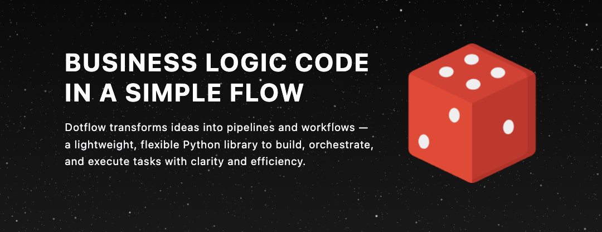

# Welcome to dotflow

  <a aria-label="Serverless.com" href="https://dotflow.io">Website</a>
  &nbsp;•&nbsp;
  <a aria-label="Dotglow Documentation" href="https://dotflow-io.github.io/dotflow/">Documentation</a>
  &nbsp;•&nbsp;
  <a aria-label="Pypi" href="https://pypi.org/project/dotflow/">Pypi</a>

With Dotflow, you get a powerful and easy-to-use library designed to create execution pipelines without complication. Add tasks intuitively and control the entire process with just a few commands.

Our goal is to make task management faster and more secure, without overwhelming you with complexity. Simply instantiate the DotFlow class, add your tasks with the `add` method, and start execution with the `start` method.

Start with the basics [here](https://dotflow-io.github.io/dotflow/).

## Getting Help

We use GitHub issues for tracking bugs and feature requests and have limited bandwidth to address them. If you need anything, I ask you to please follow our templates for opening issues or discussions.

- 🐛 [Bug Report](https://github.com/dotflow-io/dotflow/issues/new/choose)
- 📕 [Documentation](https://github.com/dotflow-io/dotflow/issues/new/choose)
- 🚀 [Feature Request](https://github.com/dotflow-io/dotflow/issues/new/choose)
- ⚠️ [Security Issue](https://github.com/dotflow-io/dotflow/issues/new/choose)
- 💬 [General Question](https://github.com/dotflow-io/dotflow/issues/new/choose)

## Commit Style

| Icon | Type      | Description                                |
|------|-----------|--------------------------------------------|
| ⚙️   | FEATURE   | New feature                                |
| 📝   | PEP8      | Formatting fixes following PEP8            |
| 📌   | ISSUE     | Reference to issue                         |
| 🪲   | BUG       | Bug fix                                    |
| 📘   | DOCS      | Documentation changes                      |
| 📦   | PyPI      | PyPI releases                              |
| ❤️️   | TEST      | Automated tests                            |
| ⬆️   | CI/CD     | Changes in continuous integration/delivery |
| ⚠️   | SECURITY  | Security improvements                      |

## License

This project is licensed under the terms of the MIT License.