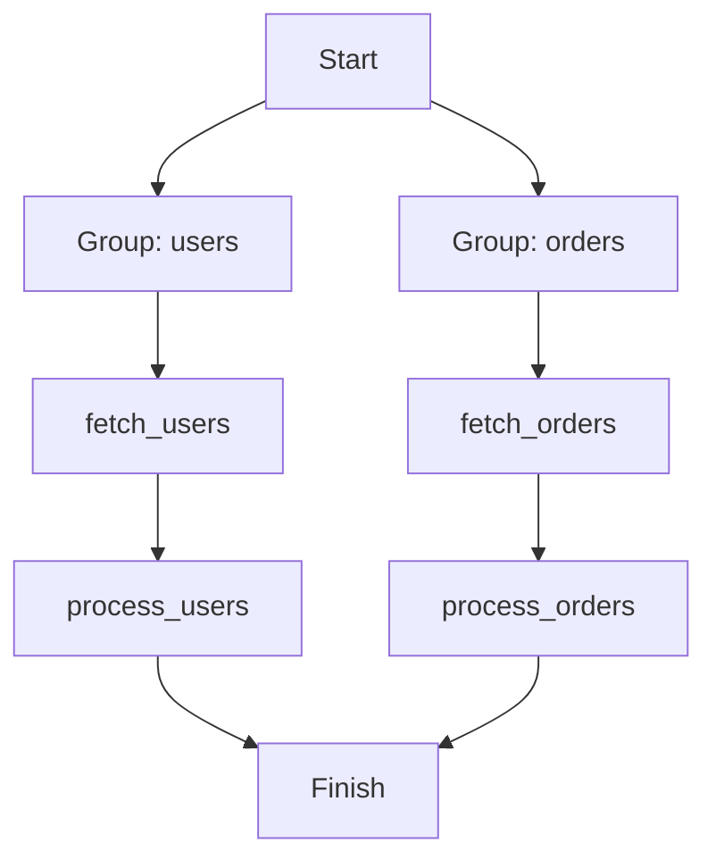

# Parallel Execution with Groups

Run independent task groups in parallel while keeping tasks within each group sequential. This is useful when you have multiple independent pipelines that share no state.

## How it works

1. Tasks with the same `group_name` run sequentially, passing context between them
2. Different groups run in parallel using separate processes
3. Results from all groups are collected after all processes complete

## Example

{* ./docs_src/advanced/parallel_with_groups.py hl[26:30] *}

## Execution flow

## References

- [Groups](https://dotflow-io.github.io/dotflow/nav/tutorial/groups/)
- [Process Mode — Parallel Group](https://dotflow-io.github.io/dotflow/nav/concepts/process-mode-parallel-group/)
