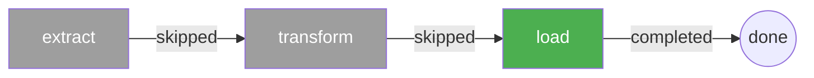

# Scheduled Pipeline with Resume

Combine cron-based scheduling with checkpoint resume to build resilient pipelines that recover automatically from failures.

## How it works

1. `SchedulerCron` runs the workflow on a cron schedule
2. `StorageFile` (or S3/GCS) persists task output after each step
3. If a step fails, the next scheduled run skips completed steps and resumes from the failure point

## Example

{* ./docs_src/scheduler/scheduler_resume_pipeline.py hl[2,24:26,28,32] *}

## Execution flow

**Day 1 — `load` fails:**

**Day 2 — automatic resume:**

## Requirements

- A **fixed `workflow_id`** — so checkpoints persist across scheduled runs
- A **persistent storage provider** — `StorageFile`, `StorageS3`, or `StorageGCS`
- `resume=True` passed to `workflow.schedule()`

## References

- [Checkpoint](https://dotflow-io.github.io/dotflow/nav/tutorial/checkpoint/)
- [SchedulerCron](https://dotflow-io.github.io/dotflow/nav/reference/scheduler-cron/)
