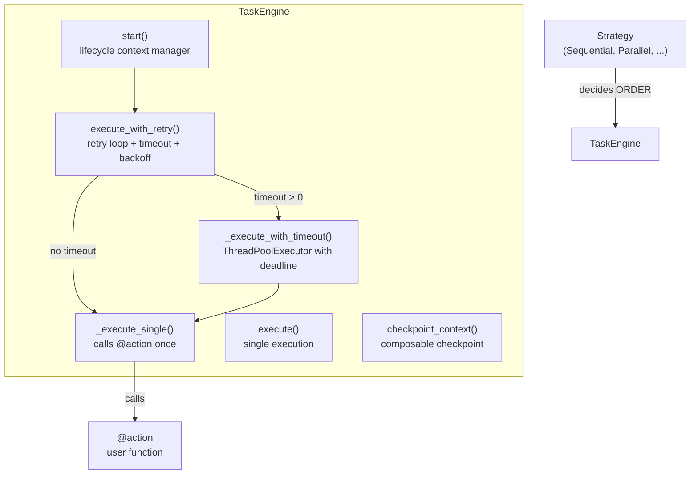
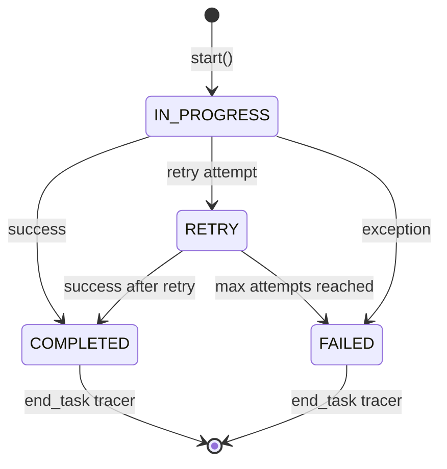
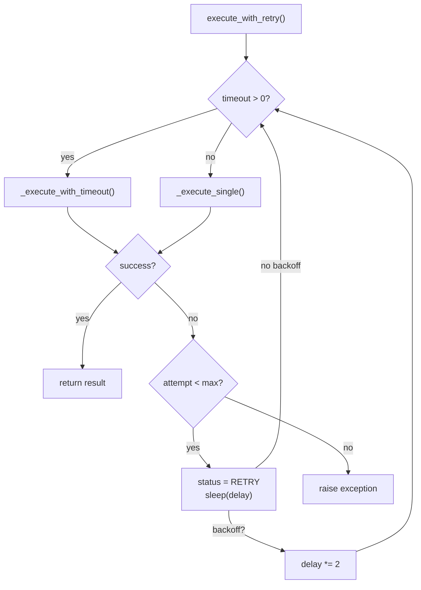

# Task Engine

The `TaskEngine` manages the **lifecycle** of a single task — status transitions, duration tracking, retry, timeout, backoff, error handling, and tracer integration. Execution strategies (`Sequential`, `Parallel`, etc.) are responsible only for **ordering and parallelism**.

## Architecture



## How it works

The engine uses a **context manager** pattern to separate lifecycle from execution:

```python
engine = TaskEngine(task=task, workflow_id=workflow_id, previous_context=previous_context)

with engine.start():
    engine.execute_with_retry()
```

### `start()` — lifecycle context manager

Manages everything that happens **around** the execution:



1. Sets `status = IN_PROGRESS` and starts the timer
2. Starts the tracer span
3. **Yields** — the execution block runs here
4. On success: sets `duration` and `status = COMPLETED`
5. On error: sets `errors` and `status = FAILED`
6. Always: ends the tracer span

### `execute_with_retry()` — retry, timeout, and backoff

Reads `retry`, `timeout`, `retry_delay`, and `backoff` from the `@action` decorator and manages the full retry loop:



- If `timeout > 0`: uses `ThreadPoolExecutor` with a real deadline
- If execution fails and `attempt < max_attempts`: sets `status = RETRY`, waits, and retries
- If `backoff = True`: doubles the delay after each failed attempt

### `execute()` — single execution

Calls the task function once without retry. Used internally by `execute_with_retry()` and available for cases where retry is not needed.

### `checkpoint_context()` — composable checkpoint

Saves a checkpoint after successful execution:

```python
with engine.start(), engine.checkpoint_context():
    engine.execute_with_retry()
```

## Composable behaviors

The context manager pattern allows adding new behaviors without modifying the engine:

```python
with engine.start():
    engine.execute_with_retry()

# Add checkpoint saving
with engine.start(), engine.checkpoint_context():
    engine.execute_with_retry()
```

Custom context managers can be composed in the same way:

```python
@contextmanager
def log_execution(engine):
    logger.info(f"Starting task {engine.task.task_id}")
    yield
    logger.info(f"Finished task {engine.task.task_id}: {engine.task.status}")

with engine.start():
    with log_execution(engine):
        engine.execute_with_retry()
```

## References

- [Task lifecycle and status](concept-task-lifecycle.md)
- [`@action` decorator](../reference/action.md)
- [`TypeStatus`](../reference/type-status.md)
