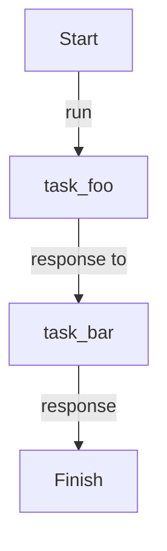

# Background

Tasks run sequentially in a background thread, freeing the main thread for other work.

## Implementation

{* ./docs_src/process_mode/background.py hl[26] *}

## Workflow

## References

- [Manager](https://dotflow-io.github.io/dotflow/nav/reference/workflow/)
