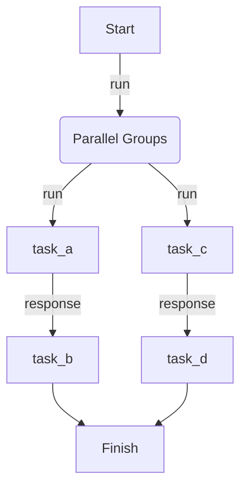

# Parallel Group

Tasks are organized into named groups. Groups run in parallel, but tasks within each group run sequentially, passing context between them.

## Implementation

{* ./docs_src/process_mode/parallel_group.py hl[26] *}

## Workflow

## References

- [Task Groups](https://dotflow-io.github.io/dotflow/nav/tutorial/groups/)
- [Manager](https://dotflow-io.github.io/dotflow/nav/reference/workflow/)
