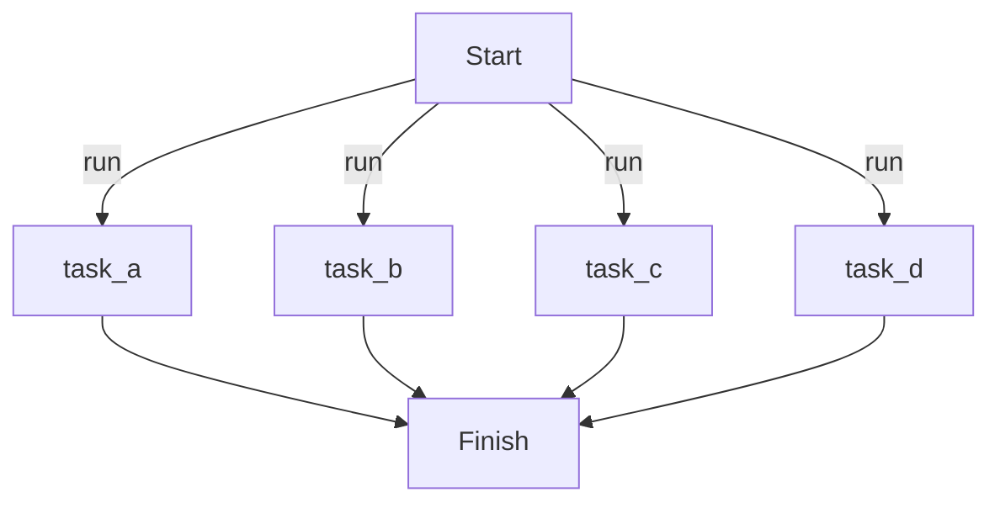

# Parallel

All tasks run simultaneously in separate processes. Each task executes independently without receiving context from other tasks.

## Implementation

{* ./docs_src/process_mode/parallel.py hl[26] *}

## Workflow

## References

- [Manager](https://dotflow-io.github.io/dotflow/nav/reference/workflow/)