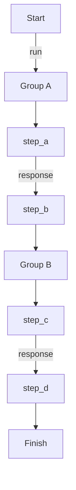

# Sequential Group

Tasks are organized into named groups. Groups run sequentially one after another, and tasks within each group also run sequentially, passing context between them.

This mode is automatically selected when you use `mode="sequential"` with multiple groups. You can also use `mode="sequential_group"` explicitly.

## Implementation

{* ./docs_src/process_mode/sequential_group.py hl[32] *}

## Workflow

## References

- [Task Groups](https://dotflow-io.github.io/dotflow/nav/tutorial/groups/)
- [Manager](https://dotflow-io.github.io/dotflow/nav/reference/workflow/)
