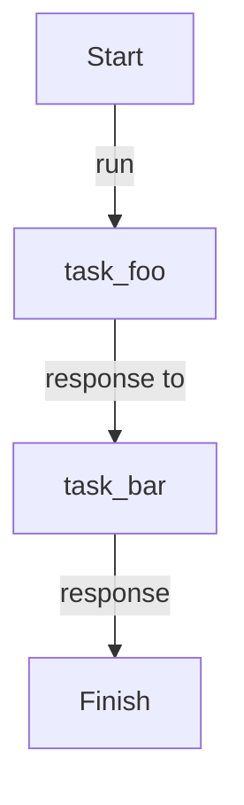

# Sequential

Tasks run one after another. Each task receives the output of the previous one as `previous_context`.

## Implementation

{* ./docs_src/process_mode/sequential.py hl[26] *}

## Workflow

## References

- [Manager](https://dotflow-io.github.io/dotflow/nav/reference/workflow/)
