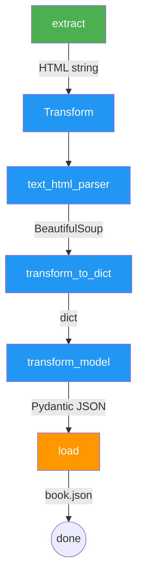

# ETL Flow

A complete Extract-Transform-Load pipeline that scrapes a web page, parses HTML into structured data with Pydantic, and saves the result to a JSON file. Optionally sends Telegram notifications on completion.

Github: [dotflow-io/examples/etl_flow](https://github.com/dotflow-io/examples/tree/master/etl_flow)

## Architecture



## Tasks

| Step | Type | Description |
|------|------|-------------|
| `extract` | Function | Fetches HTML from URL passed via `initial_context`. Retries 5 times on failure. |
| `Transform` | Class | Class-based step with 3 `@action` methods executed in source order. |
| `Transform.text_html_parser` | Method | Parses raw HTML string with BeautifulSoup. |
| `Transform.transform_to_dict` | Method | Extracts `title` and `author` from parsed HTML. |
| `Transform.transform_model` | Method | Validates with Pydantic `Book` model and serializes to JSON. |
| `load` | Function | Writes the final JSON to `book.json`. |

## Features used

- **Bulk task addition** — `workflow.task.add(step=[extract, Transform, load])`
- **Class-based steps** — `Transform` class with multiple `@action` methods
- **Retry** — `@action(retry=5)` on extract, `@action(retry=1)` on transform methods
- **Initial context** — URL passed as initial context
- **Telegram notifications** — optional, via environment variables
- **Lambda handler** — `lambda_handler` function for AWS Lambda deployment

## Run

```bash
cd examples/etl_flow
pip install -r requirements.txt
python main.py
```

## Docker

```bash
docker build -t etl-flow --file dockerfile.python .
docker run -t etl-flow
```

Available Dockerfiles: `alpine`, `debian`, `fedora`, `lambda`, `python`, `ubuntu`.
