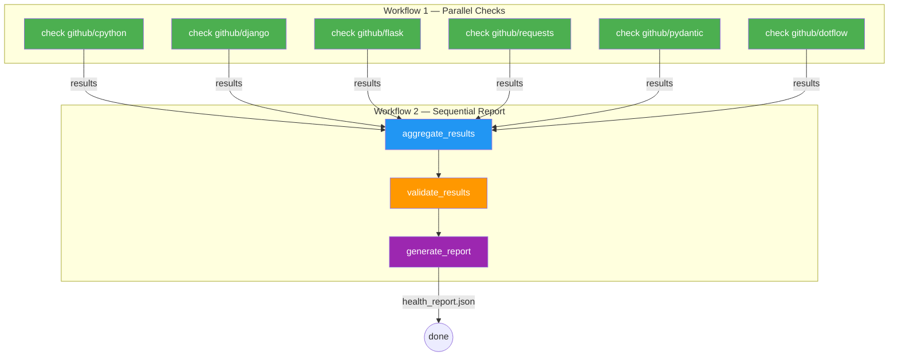

# Health Check Flow

A monitoring pipeline that checks multiple API endpoints in parallel, aggregates results, validates them, and generates a JSON report. Demonstrates multi-workflow orchestration — one workflow for parallel checks, another for sequential report generation.

Github: [dotflow-io/examples/health_check_flow](https://github.com/dotflow-io/examples/tree/master/health_check_flow)

## Architecture



## Tasks

| Step | Workflow | Description |
|------|----------|-------------|
| `check_endpoint` | Parallel | HTTP GET to each URL. Retries 2 times, timeout 6s. Returns status code and response time. |
| `aggregate_results` | Sequential | Counts OK/failed, calculates average response time. |
| `validate_results` | Sequential | Asserts all endpoints were checked and at least one succeeded. |
| `generate_report` | Sequential | Writes `health_report.json` with timestamp, summary, and detailed results. |

## Features used

- **Multi-workflow orchestration** — first workflow runs checks in parallel, second processes results sequentially
- **Parallel execution** — `checks.start(mode="parallel")` runs all endpoints simultaneously
- **Retry + timeout** — `@action(retry=2, timeout=6)` on check_endpoint
- **Initial context per task** — each task receives a different URL
- **File storage** — `StorageFile` persists context between workflows
- **Bulk task addition** — `report.task.add(step=[aggregate, validate, generate])`
- **Result inspection** — reads `task.current_context.storage` and `task.duration` after parallel execution

## Run

```bash
cd examples/health_check_flow
pip install -r requirements.txt
python main.py
```

## Docker

```bash
docker build -t health-check --file dockerfile.python .
docker run -t health-check
```

## Output

```json
{
  "generated_at": "2026-04-07 12:00:00 UTC",
  "summary": {
    "total": 6,
    "ok_count": 6,
    "fail_count": 0,
    "avg_response_time_ms": 245.32
  },
  "results": [
    {"url": "https://api.github.com/repos/python/cpython", "ok": true, "status_code": 200, "response_time_ms": 312.5},
    ...
  ]
}
```
