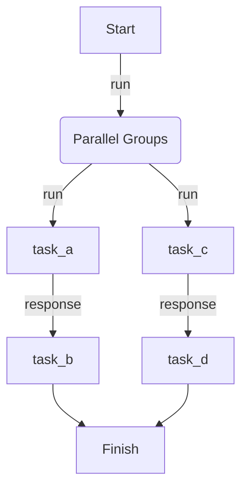

# Sequential Group

## Implementation

{* ./docs_src/process_mode/sequential_group.py hl[26] *}

## Workflow

```mermaid
flowchart TD
    A[Start] -->|run| C(Parallel Groups)
    C -->|run| D[task_a]
    C -->|run| E[task_c]
    D -->|response| X[task_b]
    X --> H[Finish]
    E -->|response| Y[task_d]
    Y --> H[Finish]
```
