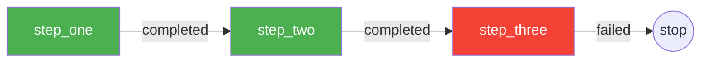
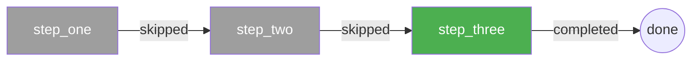

# Checkpoint (Resume from Failure)

Dotflow can resume a workflow from the last completed step after a crash or failure. No server, no database — just storage.

## How it works

1. Each completed task saves its output to storage (file, S3, GCS)
2. When `resume=True`, dotflow checks if a checkpoint exists before executing each task
3. If a checkpoint exists, the task is skipped and its saved output is used as context for the next task
4. If no checkpoint exists, the task executes normally

## Requirements

- A **fixed `workflow_id`** — so dotflow can find previous checkpoints across executions
- A **persistent storage provider** — `StorageFile`, `StorageS3`, or `StorageGCS`

/// warning
`StorageDefault` (in-memory) does not persist data. Checkpoints require a persistent storage provider.
///

## Example

{* ./docs_src/checkpoint/checkpoint.py hl[31] *}

## Execution flow

**First run — step_three fails:**

**Second run with resume=True:**

## Supported modes

| Mode | Resume support |
|------|---------------|
| `sequential` | Yes |
| `sequential_group` | Yes |
| `background` | Yes |
| `parallel` | No — tasks run independently, no sequential checkpointing |

## References

- [StorageFile](https://dotflow-io.github.io/dotflow/nav/reference/storage-file/)
- [Manager](https://dotflow-io.github.io/dotflow/nav/reference/workflow/)
