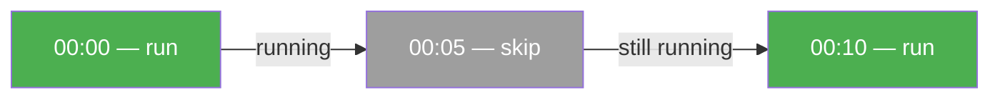
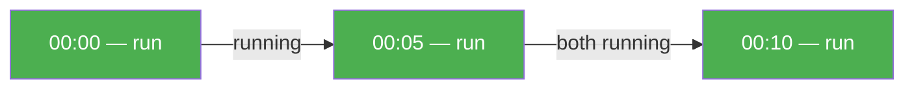

# Scheduler Cron

Run workflows on a recurring schedule using cron expressions. No external tools needed — everything stays in Python.

/// note
Requires `pip install dotflow[scheduler]`
///

## Example

{* ./docs_src/scheduler/scheduler_cron.py hl[2,17,23] *}

## With resume

Combine scheduling with checkpoint-based resume. If a run fails, the next scheduled run picks up from the last completed step.

{* ./docs_src/scheduler/scheduler_resume.py hl[22:24,30] *}

## Overlap strategies

Controls what happens when a new execution is triggered while the previous one is still running.

| Strategy | Behavior |
|----------|----------|
| `skip` (default) | If previous run is still active, skip this execution |
| `queue` | Queue the execution, run when previous completes |
| `parallel` | Run regardless, even if previous is still active |

{* ./docs_src/scheduler/scheduler_overlap.py ln[13:28] hl[15,19,23] *}

## Execution flow

**skip — cron every 5 min, task takes 7 min:**

**queue — cron every 5 min, task takes 7 min:**

**parallel — cron every 5 min, task takes 7 min:**

## Graceful shutdown

The scheduler listens for `SIGINT` (Ctrl+C) and `SIGTERM` signals. When received, the current execution finishes and the scheduler stops cleanly.

## References

- [SchedulerCron](https://dotflow-io.github.io/dotflow/nav/reference/scheduler-cron/)
- [Checkpoint](https://dotflow-io.github.io/dotflow/nav/tutorial/checkpoint/)
