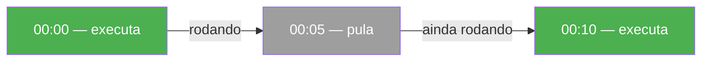
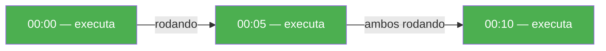

# Scheduler Cron

Execute workflows de forma recorrente usando expressões cron. Sem ferramentas externas — tudo fica em Python.

/// note
Requer `pip install dotflow[scheduler]`
///

## Exemplo

{* ./docs_src/scheduler/scheduler_cron.py hl[4,17,24] *}

## Com resume

Combine agendamento com checkpoint. Se uma execução falhar, a próxima execução agendada continua do último passo concluído.

{* ./docs_src/scheduler/scheduler_resume.py hl[22:24,32] *}

## Estratégias de overlap

Controla o que acontece quando uma nova execução é disparada enquanto a anterior ainda está rodando.

| Estratégia | Comportamento |
|------------|---------------|
| `skip` (padrão) | Se a execução anterior ainda está ativa, pula esta execução |
| `queue` | Enfileira a execução, roda quando a anterior terminar |
| `parallel` | Roda independentemente, mesmo se a anterior ainda estiver ativa |

{* ./docs_src/scheduler/scheduler_overlap.py ln[13:28] hl[15,19,23] *}

## Fluxo de execução

**skip — cron a cada 5 min, tarefa leva 7 min:**

**queue — cron a cada 5 min, tarefa leva 7 min:**

**parallel — cron a cada 5 min, tarefa leva 7 min:**

## Desligamento gracioso

O scheduler escuta sinais `SIGINT` (Ctrl+C) e `SIGTERM`. Quando recebido, a execução atual termina e o scheduler para de forma limpa.

## Referências

- [SchedulerCron](https://dotflow-io.github.io/dotflow/nav/reference/scheduler-cron/)
- [Checkpoint](https://dotflow-io.github.io/dotflow/nav/tutorial/checkpoint/)
